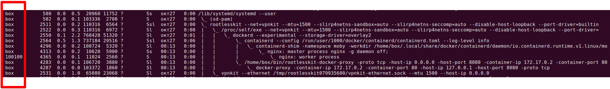

# Запуск docker в режиме rootless на ubuntu

## Как это работает

Rootless режим запускает демон докера и контейнеры в пространстве имен пользователя. Это схоже с режимом [`userns-remap`](https://docs.docker.com/engine/security/userns-remap/), за тем исключением, что в режиме `userns-remap`  демон запускается с root-привилегиями, а в rootless режиме демон запускаются без рута.

 Rootless режим не использует `SETUID` , кроме `newuidmap` и `newgidmap`, которые нужны для того, чтобы использовать множество UID/GID в пространстве имен пользователя.

## Требования

* Необходимо установить `newuidmap` и `newgidmap` на хосте. Эти команды доступны через библиотеку`uidmap` на большинстве дистрибутивов.
* `/etc/subuid` и `/etc/subgid` должны содержать не менее 65,536 доступных UID/GID для пользователя. В следующем примере пользователь`testuser` имеет 65,536 доступных UID/GID \(231072-296607\).

```text
$ id -u
1001
$ whoami
testuser
$ grep ^$(whoami): /etc/subuid
testuser:231072:65536
$ grep ^$(whoami): /etc/subgid
testuser:231072:65536
```

## Установка

```text
$ curl -fsSL https://get.docker.com/rootless | sh
```

Убедитесь, что команда была запущена не от рута. Чтобы установить докер в режиме rootless от имени рута, обратитесь к [документации докера](https://docs.docker.com/engine/security/rootless/#manual-installation).

Скрипт покажет команды, которые пропишут необходимые переменные окружения, выполните их:

```text
$ curl -fsSL https://get.docker.com/rootless | sh
...
# Docker binaries are installed in /home/testuser/bin
# WARN: dockerd is not in your current PATH or pointing to /home/testuser/bin/dockerd
# Make sure the following environment variables are set (or add them to ~/.bashrc):

export PATH=/home/testuser/bin:$PATH
export PATH=$PATH:/sbin
export DOCKER_HOST=unix:///run/user/1001/docker.sock

#
# To control docker service run:
# systemctl --user (start|stop|restart) docker
#
```

## Использование

### Демон

Используйте `systemctl --user` чтобы контролировать работу демона:

```text
$ systemctl --user start docker
```

Чтобы запускать демон при загрузке системы, включите systemd сервис и lingering:

```text
$ systemctl --user enable docker
$ sudo loginctl enable-linger $(whoami)
```

### Client

Необходимо указать сокет явно.

Чтобы указать сокет используя`$DOCKER_HOST`, выполните:

```text
$ echo "export DOCKER_HOST=unix://$XDG_RUNTIME_DIR/docker.sock" >> ~/.profile
```


После этого шага требуется разлогиниться и залогиниться снова


И, наконец, запустите контейнер nginx для теста:

```text
$ docker run -d -p 8080:80 nginx
```

Проверьте пользователя используя `ps auxf`:




Полная инструкция с нюансами для разных дистрибутивов доступна на странице документации докера \([Run the Docker daemon as a non-root user](https://docs.docker.com/engine/security/rootless/)\)



