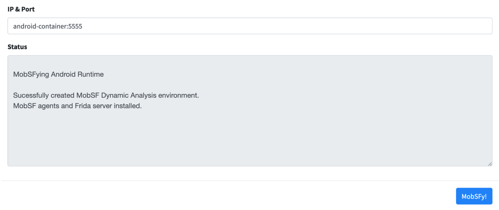

# MobSF

## Docker installation

```text
git clone https://github.com/MobSF/Mobile-Security-Framework-MobSF.git /opt/scanners/mobsf
cd /opt/scanners/mobsf
docker build . -t mobsf

docker network create mobile
```

Setup a virtual device first

```text
docker run --network=mobile --privileged -d -p 6080:6080 -p 5554:5554 -p 5555:5555 -e DEVICE="Samsung Galaxy S6" --name android-container budtmo/docker-android-x86-7.1.1
```

Then run mobsf

```text
docker run --network=mobile -it --rm -d --name mobsf -p 8000:8000 -e ADB_BINARY=/usr/bin/adb -e ANALYZER_IDENTIFIER='android-container:5555' mobsf
```

Wait for http://ip:6080 to load  
Visit http://ip:6080/dynamic\_analysis   
Click on MobSFy



## Have questions?

**Website**: [whitespots.io](https://whitespots.io/?utm=appsecwiki)   
**Email**: [sales@whitespots.io](mailto:sales@whitespots.io)

